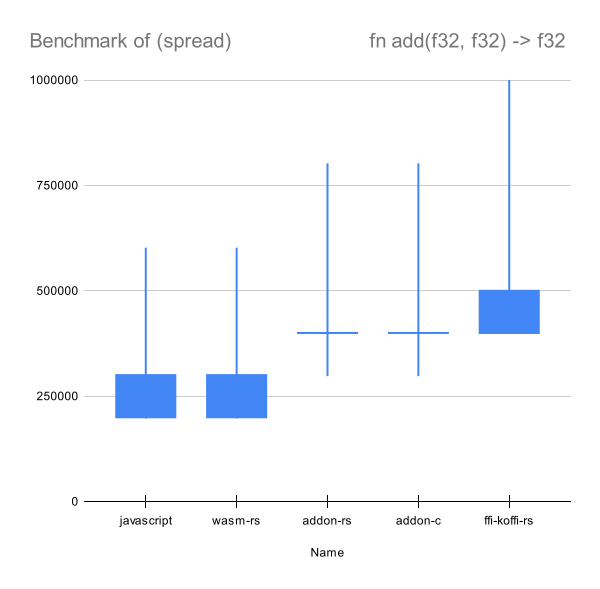
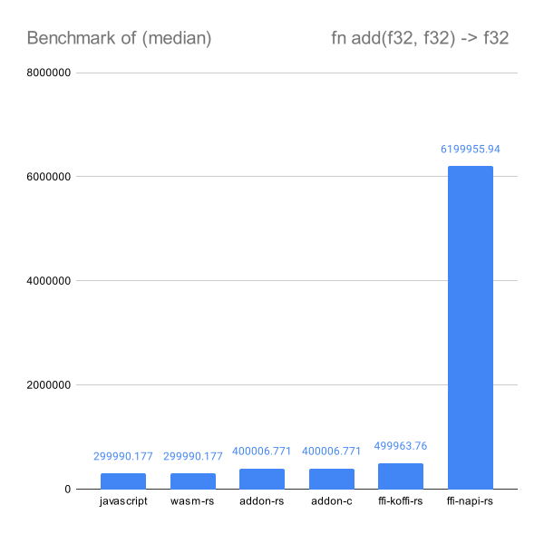

# Benchmark of various native module methods in Node

I could probably use a more complex task to do natively. This currently aims to understand the overhead on calling a function repeatedly within a native context.

## Results

Running on Node 20

Excluding ffi-napi, most of the benchmarks are pretty close to each other - including wasm!


ffi-napi is however much slower.


## Prerequisites

- GNU Core Utils (for Windows)
- Rust
- Node
- `wasm-pack`
- Clang/GCC/MSVC

```
# This will install and build the packages
npm install

# This will run the benchmarks and create a report.csv
npm start
```